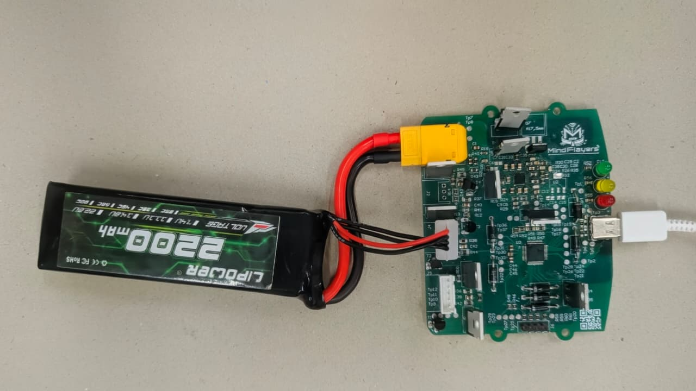
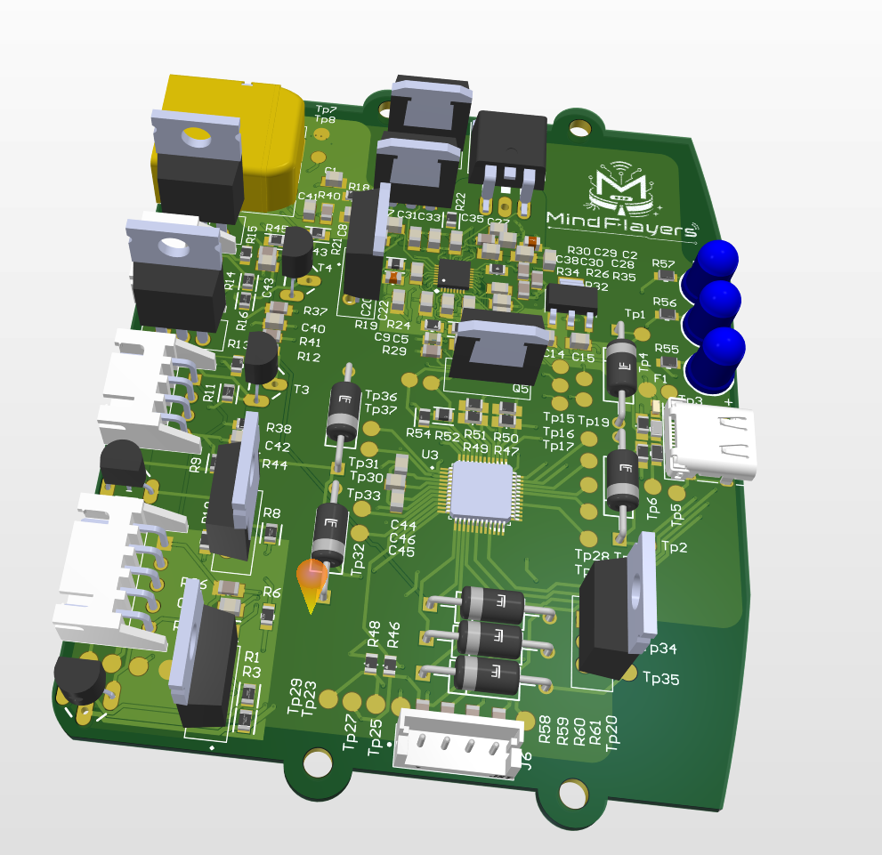
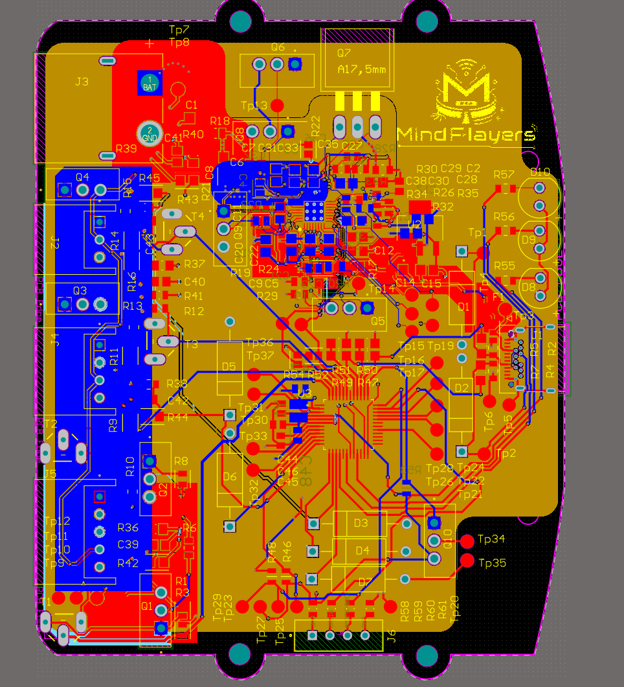

#  🔋 Charging Sub-System

### LiPo charging hardware and firmware for the Smart Autonomous Floor Mopping Robot

A USB-C Power Delivery charger that charges and balances the robot's onboard
LiPo pack - built around an STM32G0 MCU and a TI BQ25703A buck-boost charger.

 

  
   
  <em>Assembled, populated, and bench-tested charging board</em>

 

  
   
  <em>3D view - Altium render</em>

 

  
   
  <em>PCB layout - all layers active</em>

---

## Overview

This sub-system takes power from a USB Type-C PD source, negotiates a supply
voltage, and charges a multi-cell lithium-polymer pack through a TI BQ25703A
programmable buck-boost charge controller supervised by an STM32G0. Per-cell
voltages are read through the MCU's ADC, and passive balancing keeps the pack
matched during charge. The design is adapted from the open-source LiPow charger.

It is split into two parts - the **hardware** (Altium PCB) and the **firmware**
(STM32G0) - each documented in its own folder.

## Contents

| Folder | Description |
|---|---|
| **[`EDR_LIPO/`](EDR_LIPO)** | Hardware - Altium schematics, PCB layout, renders, and board photos for the LiPo charging board |
| **[`edr_Lipo_1v1/`](edr_Lipo_1v1)** | Firmware (v1.1) - STM32G0 project: USB-PD negotiation, BQ25703A charge control, and cell balancing |

## Technical Specifications

### System

| Parameter | Value |
|---|---|
| Function | USB-C PD LiPo battery charger and balancer |
| Charge algorithm | CC/CV via TI BQ25703A |
| CAD tool | Altium Designer |
| Firmware version | v1.1 |
| Board status | Assembled and bench-tested |

### Microcontroller

| Parameter | Value |
|---|---|
| MCU | STM32G071CBTx |
| Core | Arm Cortex-M0+ @ up to 64 MHz |
| Flash / SRAM | 128 KB / 36 KB |
| Package | LQFP48 |
| RTOS | FreeRTOS |
| USB-PD stack | UCPD peripheral + ST X-CUBE-USBPD |

### Power & charging

| Parameter | Value |
|---|---|
| Input connector  | USB Type-C |
| Input protocol | USB Power Delivery (sink) |
| PD current requested | Up to 3 A *(firmware PDO configuration)* |
| Charge controller | TI BQ25703A buck-boost, over I²C |
| Charge output | XT60 connector |
| Balance connector | JST-XH |
| Supported packs | 1S – 4S *(per firmware cell-count bitmasks)* |
| Cell monitoring | STM32G0 ADC via resistor dividers |
| Balancing | Passive, per-cell *(LiPow reference: PFET discharge)* |
| Max power *(reference)* | Up to 100 W / 6 A - *LiPow reference; verify for this build* |

### Interfaces

| Interface | Use |
|---|---|
| I²C | STM32G0 → BQ25703A charge controller |
| UART | Debug / command-line interface |
| SWD | Programming and debug |
| RGB LED  | Charge / balance status feedback |

### Protection thresholds

From the firmware (`edr_Lipo_1v1/Core/Inc/battery.h`). Verify against your pack
chemistry before connecting a real battery.

| Condition | Value |
|---|---|
| Start charging (per cell below) | 4.18 V |
| Begin balancing discharge (per cell above) | 4.205 V |
| Stop charging - over-voltage (per cell above) | 4.22 V |
| Minimum cell for balancing | 3.0 V |
| Absolute minimum safe cell voltage | 2.0 V |
| Enable balancing when cell delta exceeds | 15 mV (10 mV hysteresis) |
| MCU over-temp cutoff / recovery | 75 °C / 65 °C |

> Values in *italics* come from the LiPow reference design rather than a confirmed
> reading of this board. These limits protect the pack but are not a substitute for
> a proper BMS - never charge LiPo cells unattended.

---

## License

Copyright © 2026 **@tharinadacwa**.

This project is licensed under the **GNU General Public License v3.0** - see the
[`LICENSE`](LICENSE) file for the full text. You are free to use, study, modify,
and share it under the same license.

 
Board revision, firmware port, integration and testing for the Smart Autonomous Floor Mopping Robot by <b>@tharinadacwa</b>

