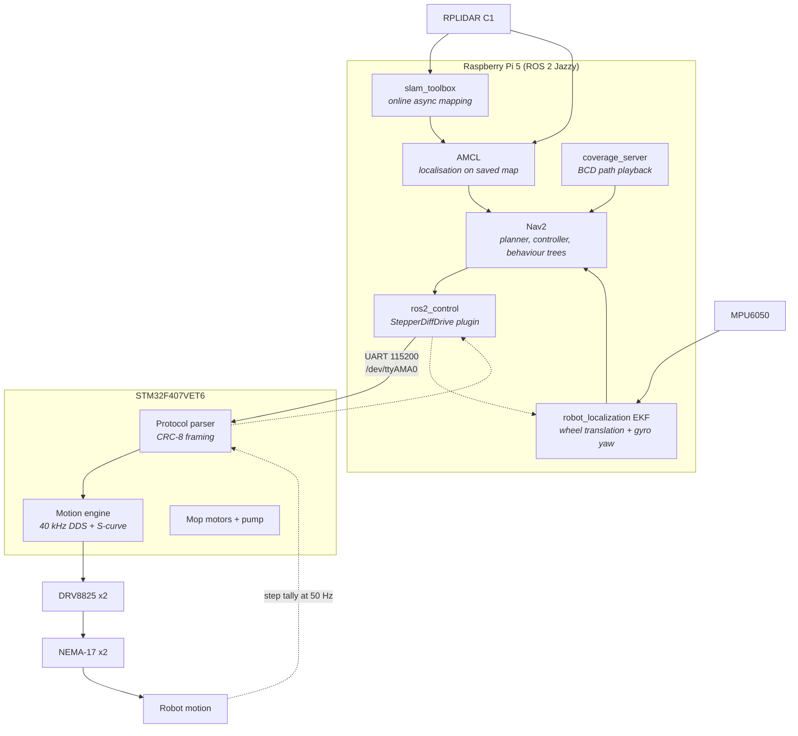
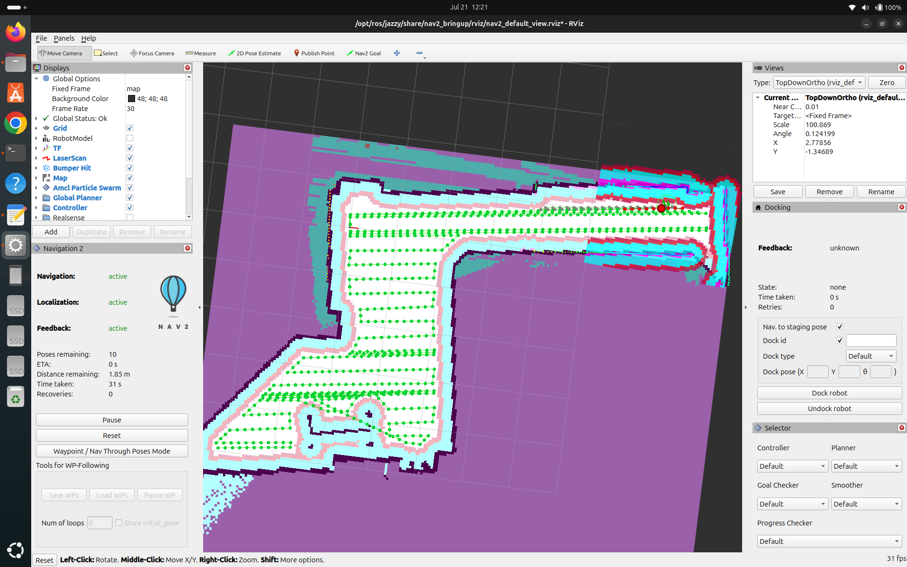

<div align="center">

# SAFMR: Smart Autonomous Floor Mopping Robot

### A full-stack autonomous cleaning robot: LiDAR SLAM, Boustrophedon coverage planning, real-time stepper control, and a custom USB-C PD charging board


<br>


<sub><b>Team MindFlayers</b></sub>

</div>

---

## Table of contents

- [What this is](#what-this-is)
- [The problem we set out to solve](#the-problem-we-set-out-to-solve)
- [System at a glance](#system-at-a-glance)
- [Architecture](#architecture)
- [Repository structure](#repository-structure)
- [Subsystem 1: Navigation and coverage planning](#subsystem-1-navigation-and-coverage-planning)
- [Subsystem 2: Main controller (firmware and PCB)](#subsystem-2-main-controller-firmware-and-pcb)
- [Subsystem 3: Charging sub-system](#subsystem-3-charging-sub-system)
- [The numbers that everything derives from](#the-numbers-that-everything-derives-from)
- [The UART contract](#the-uart-contract)
- [Quick start](#quick-start)
- [Documentation index](#documentation-index)
- [Safety](#safety)
- [Known gaps and things to reconcile](#known-gaps-and-things-to-reconcile)
- [Roadmap](#roadmap)
- [License](#license)

---

## What this is

SAFMR maps a room with LiDAR, plans a provably complete cleaning route across it,
and then sweeps, mops and vacuums that route without anyone pushing it. It is not
a random-bounce consumer robot: every square metre of reachable floor is visited
deliberately, and the robot can report afterwards what it actually cleaned.

The project spans four disciplines and all of them are in this repository:

| Discipline | What we built |
|---|---|
| **Robotics software** | ROS 2 Jazzy stack with Nav2, slam_toolbox, AMCL, EKF fusion, and a Boustrophedon Cellular Decomposition coverage planner written from first principles |
| **Embedded firmware** | STM32F407 real-time motion controller: 40 kHz DDS pulse engine, jerk-limited S-curve profiling, CRC-8 framed serial protocol |
| **Hardware design** | Two Altium boards: the main controller PCB and a USB-C Power Delivery LiPo charger |
| **Systems integration** | A split-brain architecture where the Pi plans and the STM32 actuates, joined by one carefully specified UART link |

| Headline specification | Value |
|---|---|
| Chassis | 45 cm class, 380 mm body disc, 420 mm across the wheels |
| Cleaning head | Dual mopping discs plus sweep brushes, 300 mm swept width |
| Coverage | Complete over reachable drivable area (see [coverage definitions](#known-gaps-and-things-to-reconcile)) |
| Runtime | Approximately 60 minutes per charge |
| Compute | Raspberry Pi 5 (Ubuntu Server 24.04) plus STM32F407VET6 |
| Control | Android app, or ROS 2 service calls |
| Target price | Approximately LKR 200,000 |

---

## The problem we set out to solve

We surveyed 20 facility managers across offices, hospitals and hotels in Sri Lanka:

| Finding | Share |
|---|---|
| Say labour cost and staffing is their single biggest cleaning challenge | 45% |
| Are already looking to buy or rent a commercial cleaning robot | 65% |
| Would consider buying at approximately LKR 200,000 | 95% |
| Rate cutting cleaning labour hours as very important (6 or 7 out of 7) | 80% |
| Say results are inconsistent because it depends who is mopping that day | 35% |
| Say cleaning simply takes too long to get through | 15% |
| Flag staff safety on wet or busy floors | 5% |

Capable autonomous scrubbers already exist, but as imported units priced far out
of reach for most local facilities. That gap is the thing this project targets.

---

## System at a glance

| Layer | Component | Role |
|---|---|---|
| High-level controller | Raspberry Pi 5, Ubuntu Server 24.04 | ROS 2 Jazzy, Nav2, SLAM, coverage planning |
| Low-level controller | STM32F407VET6 | Real-time step generation, motion sequencing, mop and pump control |
| Charger controller | STM32G071CBTx | USB-PD negotiation, BQ25703A charge control, cell balancing |
| LiDAR | RPLIDAR C1 | 2D scanning for SLAM, localisation and obstacle sensing |
| IMU | MPU6050 | Yaw rate for rotation correction |
| Drive | 2 x NEMA-17 42-34 via DRV8825 at 1.4 A, 1/16 microstep | Differential drive, deliberately **encoderless** |
| Cleaning | 4 x brushed DC motors via 2 x L298N, plus a water pump on an IRLZ44N | Mopping discs, sweep brushes, water feed |
| Power | Isolated motor and logic rails, LiPo pack | Motor supply kept off the Pi rail |

### The one design decision that shapes everything

**The robot has no wheel encoders, by choice.** Closed-loop behaviour is recovered
from two independent sources instead:

1. **Translation** comes from verified step counts. The STM32 counts every pulse it
   emits and reports an exact cumulative tally, so distance closes on the commanded
   value rather than on elapsed time.
2. **Rotation** comes from the MPU6050 gyroscope, integrated. Wheel-derived heading
   is explicitly distrusted and is disabled in the EKF, because a single lost step on
   an encoderless drivetrain corrupts the yaw estimate permanently.

That split is why the firmware bothers with jerk-limited S-curve profiling, and why
the EKF configuration deliberately throws away wheel yaw. Both choices exist to
protect an odometry source that has no way to detect its own errors.

---

## Architecture



### The three operating phases

| Phase | When | What happens |
|---|---|---|
| **1. Map** | Once per environment | Drive the robot manually while `slam_toolbox` builds a pose graph, then save with `map_saver_cli` |
| **2. Plan** | Offline, on a laptop | `bcd_coverage.py` cleans the map, runs reachability QA, decomposes it into cells, and freezes a waypoint list plus a preview PNG you actually look at before trusting it |
| **3. Clean** | Every run, on the Pi | `map_server` and AMCL localise, `coverage_server` replays the frozen path through Nav2, the STM32 executes it |

Planning offline is deliberate. The coverage path is reviewed by a human before the
robot is allowed to drive it, which catches unreachable regions and pinched corridors
before they become a robot wedged behind a sofa.

---

## Repository structure

This repository uses **one branch per engineering discipline**, with `main` as the
integrated view containing all of them.

| Branch | Contents |
|---|---|
| **`main`** | Everything below, integrated. Start here. |
| `Self_Navigation` | ROS 2 workspace, coverage planner, SLAM and Nav2 configuration |
| `Firmware_Design` | STM32F407 main controller firmware |
| `PCB_Design` | Altium hardware for the main controller board |
| `Hardware_Integration` | Wiring, assembly and integration work |
| `3D_Design` | Mechanical CAD for the chassis and cleaning head |

```
SAFMR/
├── Navigation/                  ROS 2 Jazzy stack and coverage planner
│   ├── bcd_coverage.py            standalone BCD planner (offline)
│   ├── robot.yaml                 SINGLE SOURCE OF TRUTH for physical parameters
│   ├── tools/generate_config.py   regenerates every derived config from robot.yaml
│   ├── ros2_ws/src/
│   │   ├── minibot_bringup/       launch files, controllers, udev, systemd
│   │   ├── minibot_coverage/      coverage server and map preparation
│   │   ├── minibot_description/   URDF, xacro, RViz layouts
│   │   ├── minibot_hardware/      ros2_control StepperDiffDrive plugin (C++)
│   │   ├── minibot_imu/           MPU6050 node, calibration, EKF config
│   │   └── minibot_navigation/    Nav2 params, behaviour trees, keepout filters
│   ├── robot_files/               bring-up scripts used before the plugin existed
│   ├── maps/                      saved occupancy grids
│   ├── media/                     demonstration images and GIFs
│   └── docs/                      six deep-dive documents (see index below)
│
├── MAIN_CONTROLLER/             STM32F407 firmware and main PCB
│   ├── README.md                  full firmware documentation
│   ├── firmware_Main/minibot_fw/  CubeIDE project, HAL drivers, wiring guides
│   └── SFAMR_MainPCB/             Altium schematic, PCB layout, libraries
│
├── Charging_Sub_System/         USB-C PD LiPo charger
│   ├── README.md                  charger documentation
│   ├── EDR_LIPO/                  Altium hardware, 3D renders, board photos
│   └── edr_Lipo_1v1/              STM32G0 firmware: UCPD, BQ25703A, balancing
│
├── MIND FLAYERS project pitch.pdf
├── LICENSE                      GNU GPL v3
└── README.md                    this file
```

---

## Subsystem 1: Navigation and coverage planning

> Full documentation: [`Navigation/README.md`](Navigation/README.md)

<div align="center">

<br><sub>RViz2: map, costmaps, TF tree and colour-coded coverage waypoints</sub>
</div>

### Boustrophedon Cellular Decomposition

*Boustrophedon* is Greek for "as the ox turns while ploughing", which is exactly the
back-and-forth motion the planner produces. The classic formulation is due to Choset.

**How it works.** A vertical sweep line passes across the map one pixel column at a
time, counting connected free slices in that column. When the count changes, an
obstacle has started or ended, and that column is a *critical point*. A slice count
increase is an IN event that splits the current cell; a decrease is an OUT event that
merges and closes cells. Each resulting cell is obstacle-free by construction, so
covering it reduces to sweeping parallel lanes.

**Why decompose at all.** A room with obstacles is not a rectangle. A single sweep
pattern would either clip obstacles or leave gaps. Decomposition turns a hard problem
into many trivial ones.

**Why zig-zag rather than return-to-start.** Entering each lane from the side you
finished on removes the return trip, which would otherwise nearly double travel
distance, and confines turns to lane ends.

| Criterion | Random bounce | BCD |
|---|---|---|
| Coverage guarantee | Probabilistic | Complete over reachable space |
| Overlap | Uncontrolled | Fixed by lane spacing |
| Runtime | Long and variable | Predictable, estimated before running |
| Repeatability | Different every run | Deterministic |
| Progress reporting | Not possible | Per-waypoint |

**Implementation details that matter:**

- Free space is eroded by robot radius plus safety margin, so the planned path is a
  valid **centre** trajectory rather than a wish.
- Unknown map cells are treated as blocked, so the planner never routes into unmapped
  space.
- Only the connected component reachable from the start pose is planned.
- Hairline gaps in walls are sealed morphologically so lanes cannot leak into the next
  room through a one-pixel crack.
- A **Hough transform finds the dominant wall angle** and the map is rotated so lanes
  run parallel to the walls, not to the image axes.

<div align="center">

<br><sub>A generated coverage path: edge pass plus serpentine fill</sub>
</div>

### Software stack

| Layer | Technology |
|---|---|
| Middleware | ROS 2 Jazzy |
| Navigation | Navigation2 (NavFn planner, Regulated Pure Pursuit controller) |
| SLAM | slam_toolbox, online asynchronous |
| Localisation | AMCL |
| Fusion | robot_localization EKF, wheel yaw deliberately excluded |
| Hardware interface | ros2_control C++ plugin, `StepperDiffDrive` |
| Coverage planner | Python, OpenCV, NumPy, SciPy |
| Visualisation | RViz2 with live coverage progress markers |

### Deployment

Headless operation is handled by `udev` rules for stable device naming and `systemd`
units for auto-start, both in `minibot_bringup`.

---

## Subsystem 2: Main controller (firmware and PCB)

> Full documentation: [`MAIN_CONTROLLER/README.md`](MAIN_CONTROLLER/README.md)

The STM32F407VET6 owns four independent jobs:

| Subsystem | Hardware | Control |
|---|---|---|
| **Drive** | 2 x stepper via DRV8825 | 40 kHz DDS pulse engine, jerk-limited S-curve, commanded over UART |
| **Mopping** | 4 x brushed DC via 2 x L298N | Fixed direction, running from boot, no speed control |
| **Water pump** | IRLZ44N low-side MOSFET | Free-running timer, 3 s on and 5 s off |
| **Host link** | USART1 to the Pi | CRC-8 framed ASCII, 50 Hz odometry feedback |

### Why the motion engine is built the way it is

**Direct digital synthesis for step timing.** A 32-bit phase accumulator per motor is
incremented every 40 kHz tick; a wrap past 2^32 emits one step pulse and increments the
step counter in the same operation. That coupling is the reason reported odometry is a
tally rather than an estimate. Because the accumulator increment stays below 0.5 for any
rate under 20 kHz, two pulses can never land on consecutive ticks, so the minimum low
time is guaranteed by arithmetic rather than by luck. At the configured 1066 sps ceiling
the engine runs at 5.3% of that limit.

**Jerk limiting is not a nicety.** A trapezoidal ramp steps acceleration discontinuously
from zero to maximum, which is a torque step, which is exactly the impulse that makes a
stepper skip. This robot reverses direction at the end of every lane, roughly 34 times
per room, with no encoder to notice a skipped step. The S-curve is what keeps odometry
honest across a full run.

**Interrupt priority is deliberate.** TIM7 sits at priority 0, above USART1 at 1. The
step ISR takes about 2 microseconds and a UART byte arrives every 87 microseconds at
115200 baud, so the UART is serviced roughly 2 microseconds late in the worst case, well
inside its deadline. Giving the UART top priority instead would trade a problem you do
not have for one you cannot detect.

### Safety behaviour

| Mechanism | Behaviour |
|---|---|
| Boot order | GPIO init runs first and drives `nENABLE` high, so the steppers are dead before anything can twitch |
| Comms watchdog | No command for 500 ms triggers a ramp to stop while staying energised, keeping holding torque so the robot cannot roll on a slope |
| Idle disable | No command for 10 s drops the coils, because a stationary stepper at full current is a 10 W heater doing no work |
| Emergency stop | Bypasses the profile entirely; losing steps is an acceptable trade for stopping now |
| Fault handlers | HardFault, BusFault and UsageFault kill the steppers and the mop motors, then hang |
| UART overrun recovery | An unhandled overrun error silently kills reception forever, so the error ISR clears every flag and re-arms |

### Hardware

The main controller PCB was designed in Altium and lives in
[`MAIN_CONTROLLER/SFAMR_MainPCB/`](MAIN_CONTROLLER/SFAMR_MainPCB), alongside the
schematic, layout and custom footprint libraries.

---

## Subsystem 3: Charging sub-system

> Full documentation: [`Charging_Sub_System/README.md`](Charging_Sub_System/README.md)

<div align="center">

<br><sub>Assembled, populated and bench-tested charging board</sub>
</div>

A USB Type-C Power Delivery charger that negotiates a supply voltage, then charges and
balances the onboard LiPo pack through a TI BQ25703A programmable buck-boost controller
supervised by an STM32G071. Per-cell voltages are read through the MCU ADC and passive
balancing keeps the pack matched during charge. The design is adapted from the
open-source LiPow charger.

| Parameter | Value |
|---|---|
| MCU | STM32G071CBTx, Cortex-M0+ at up to 64 MHz, 128 KB flash, 36 KB SRAM |
| RTOS | FreeRTOS |
| USB-PD stack | UCPD peripheral plus ST X-CUBE-USBPD |
| Charge controller | TI BQ25703A buck-boost over I2C |
| Charge algorithm | CC/CV |
| Supported packs | 1S to 3S |
| Connectors | USB-C in, XT60 out, JST-XH balance |
| Status | Assembled and bench-tested |

Protection thresholds, cell voltage limits and the over-temperature cutoff are
documented in the subsystem README and defined in `edr_Lipo_1v1/Core/Inc/battery.h`.

> **Never charge LiPo cells unattended.** These thresholds protect the pack but are not
> a substitute for a proper BMS.

---

## The numbers that everything derives from

[`Navigation/robot.yaml`](Navigation/robot.yaml) is the single source of truth. Running
`python3 Navigation/tools/generate_config.py` regenerates every derived configuration
from it.

This matters because the same physical constants live in **five** places: the STM32
firmware, ros2_control, the Nav2 controller server, the Nav2 velocity smoother, and the
coverage planner. If any two disagree, the strictest layer silently clips the others,
and the planner then believes the robot went somewhere it did not.

### Measured geometry

| Quantity | Value | Note |
|---|---|---|
| Wheel diameter | 67.2 mm | Measure it **loaded**; rubber compresses about 1 mm, which is a 3% odometry error |
| Wheel radius | 0.0336 m | |
| Wheel separation | 0.400 m | Centre-to-centre of contact patches |
| Wheel outer span | 0.410 to 0.420 m | |
| `robot_radius` | **0.210 m** | Half the **wheel** span, not half the body |
| Body diameter | 0.380 m | Narrower than the wheels |
| LiDAR height | 0.250 m from ground | |
| Robot mass | about 6 kg | |

**The wheels are the widest part of the robot.** Nav2 plans against 0.210 m. Plan
against the body radius instead and Nav2 will confidently drive the wheels into walls
it believes the body clears, which presents as "the robot keeps scraping along walls"
and looks like a controller bug.

### Kinematic envelope

| Quantity | Value |
|---|---|
| Steps per wheel revolution | 3200 (200 steps x 16 microstep) |
| Distance per step | **0.066 mm**, your odometry resolution |
| Linear velocity | 0.0176 to 0.0704 m/s |
| Angular velocity | 0.088 to 0.352 rad/s |
| 180 degree spin in place | 8.93 s |
| Step rate cap | 1066 sps, which is 5.3% of the pulse engine |

### Two limits worth understanding

**The 20 RPM cap is the single biggest cost in the project.** At 20 RPM the pulse
engine is 5.3% used and the motors carry roughly 12x torque margin at 6 kg. Raising it
is one number in `robot.yaml` followed by a regeneration:

| RPM | Speed | Step rate | Pulse engine used | 49 m^2 flat |
|---|---|---|---|---|
| 20 | 0.070 m/s | 1066 sps | 5.3% | about 95 min |
| 40 | 0.141 m/s | 2133 sps | 10.7% | about 47 min |
| 60 | 0.211 m/s | 3200 sps | 16.0% | about 31 min |
| 100 | 0.352 m/s | 5333 sps | 26.7% | about 19 min |

**The 9 cm wall strip is mechanical, not a software bug.** The robot centre cannot get
closer to a wall than `robot_radius` plus `safety_margin` (0.210 + 0.030 = 0.240 m), and
the brush span reaches only 0.150 m from centre, so the brush stops 9 cm short of every
wall. No planner fixes this. The options are to accept it, drop the safety margin to
0.01 for a 7 cm strip at the cost of wall clearance, or mount the brushes further
outboard, which is the real fix.

---

## The UART contract

One serial link joins the two halves of the robot, so its specification is the most
important interface in the project.

```
$<PAYLOAD>*<CRC8_HEX><LF>
```

CRC-8/ATM, polynomial `0x07`, init `0x00`, no reflection, no final XOR, computed over
the payload only. A `$` always restarts the parser, which is what lets it resynchronise
after line noise.

### Pi to STM32

| Frame | Meaning |
|---|---|
| `$V,<left_sps>,<right_sps>*XX` | Signed step-rate target; also enables drivers and clears E-stop |
| `$E,<0 or 1>*XX` | Enable or disable the stepper drivers |
| `$S*BE` | Emergency stop, bypasses the ramp |
| `$R*B9` | Reset step counters |
| `$P*B7` | Ping, answered with `$K*F6` |

### STM32 to Pi, at 50 Hz

```
$F,<l_steps>,<r_steps>,<l_sps>,<r_sps>,<flags>,<seq>*XX
```

The cumulative signed step counts are the odometry. The sequence number lets the host
detect dropped frames rather than silently interpolating across them. Flags report
enabled, E-stop, command timeout, CRC error, UART overrun and rate clamping.

**Why CRC-8 and not a checksum.** The motor wires running alongside this cable switch
amps at kilohertz rates. One flipped bit in a velocity command is a robot driving into a
wall. CRC-8 catches all single-bit errors, all double-bit errors, and all burst errors up
to 8 bits. A sum or an XOR does not.

---

## Quick start

### Prerequisites

| Where | What |
|---|---|
| Raspberry Pi 5 | Ubuntu Server 24.04, ROS 2 Jazzy, Nav2, slam_toolbox, robot_localization |
| Laptop | Python 3.12 with OpenCV, NumPy, SciPy for offline planning |
| Firmware | STM32CubeIDE, or `arm-none-eabi-gcc` 13.2.1 with `stlink-tools` |
| Hardware CAD | Altium Designer |

### 1. Flash the main controller

```bash
cd MAIN_CONTROLLER/firmware_Main/minibot_fw
make
make flash
```

Before the first flash, confirm your crystal is 8 MHz. Many F407VET6 boards ship with
25 MHz, and if yours does, both the baud rate and the step rate are wrong by the same
25/8 ratio. The firmware README documents the two-line fix.

### 2. Set up the Pi

```bash
cd Navigation
bash tools/setup_pi.sh
cd ros2_ws && colcon build --symlink-install
source install/setup.bash
```

### 3. Map the room

```bash
ros2 launch minibot_bringup robot.launch.py
ros2 launch minibot_bringup map.launch.py
# drive it around with teleop, then:
ros2 run nav2_map_server map_saver_cli -f maps/home
```

### 4. Plan coverage offline

```bash
python3 bcd_coverage.py maps/home.yaml --out home_coverage_path.yaml
```

This also writes a QA report and a preview PNG. **Look at the preview before running
it.** The QA report flags unreachable regions, narrow corridors and the estimated run
time.

### 5. Clean

```bash
ros2 launch minibot_bringup clean.launch.py map:=maps/home.yaml \
     path:=home_coverage_path.yaml
ros2 service call /coverage/start std_srvs/srv/Trigger
```

`auto_start` is deliberately false. Confirm AMCL has converged in RViz before starting
the run.

Runtime control is exposed as services: `/coverage/start`, `/coverage/stop` (resumable,
the checkpoint is kept), `/coverage/skip` for when the robot is wedged, and
`/coverage/dock`.

---

## Documentation index

| Document | Covers |
|---|---|
| [`Navigation/README.md`](Navigation/README.md) | Coverage planning, SLAM, the full ROS 2 stack, file-by-file manifest |
| [`Navigation/docs/ARCHITECTURE.md`](Navigation/docs/ARCHITECTURE.md) | Node graph, the three phases, TF ownership |
| [`Navigation/docs/HARDWARE.md`](Navigation/docs/HARDWARE.md) | Measured geometry, wiring, the wall-strip and brush-gap analyses |
| [`Navigation/docs/INTERFACES.md`](Navigation/docs/INTERFACES.md) | Every topic, service, action, TF frame and UART packet |
| [`Navigation/docs/DERIVED_NUMBERS.md`](Navigation/docs/DERIVED_NUMBERS.md) | How every velocity and limit is derived, plus the Revision 2 correction |
| [`Navigation/docs/TESTING.md`](Navigation/docs/TESTING.md) | Verification procedure |
| [`Navigation/docs/REVISION_2.md`](Navigation/docs/REVISION_2.md) | What changed when the hardware was actually measured |
| [`MAIN_CONTROLLER/README.md`](MAIN_CONTROLLER/README.md) | Firmware architecture, pin map, protocol, bring-up checklist, troubleshooting |
| [`Charging_Sub_System/README.md`](Charging_Sub_System/README.md) | Charger hardware, firmware, protection thresholds |

### A note on Revision 2

Revision 1 of this project used a wheel radius of 0.19 m and a wheel separation of
0.30 m. Both were wrong. The real figures are 0.0336 m and 0.400 m, meaning the wheel
radius was off by a factor of 5.65 and every velocity, every Nav2 threshold and the
entire URDF were wrong with it. `docs/REVISION_2.md` documents the correction. We have
left that history in the repository deliberately, because the failure mode is instructive:
nothing crashed, nothing threw an error, the robot simply believed it had travelled
distances it had not.

---

## Safety

**Read before powering the robot for the first time.**

At power-on with no host connected, the stepper drivers stay disabled, but **the four
mop motors start immediately** and the water pump begins cycling. Both are open-loop and
run from boot with no host command and no way to stop them over the serial link. On a
workbench, comment out `DCM_Run()` and the pump task before the first power-up.

**Common ground is mandatory.** The STM32 ground, both L298N ground terminals, the
MOSFET source and the battery negative must all be one node. A missing common ground is
the single most frequent cause of "the motors behave randomly".

**Verify microstepping before trusting any distance.** If the DRV8825 jumpers are
actually 1/8, or the motors are 0.9 degrees per step, every distance is silently double
what the robot thinks and nothing in the system will tell you. The firmware README
includes a step-verification procedure.

**Never charge LiPo cells unattended.**

---

## Known gaps and things to reconcile

Documented honestly, because a project this size accumulates loose ends and the next
person should not have to find them the hard way.

**Two different coverage figures are quoted.** The project pitch says approximately 94%
coverage. The QA report from a real map run reports 100% of *reachable drivable area*
and 80.8% of *total floor swept by the body*. These measure different things and both are
defensible, but the repository should state which definition it means wherever a
percentage appears.

**Chassis dimension inconsistency.** The pitch describes a 45 cm chassis; `robot.yaml`
records a 380 mm body with a 410 to 420 mm wheel span. Worth reconciling to one number
before submission.

**Lane spacing disagreement.** `robot.yaml` sets `lane_spacing: 0.19` against a 0.30 m
cleaning head, which is 11 cm of overlap on every pass, or 37% of the floor cleaned
twice. The QA report was generated at 0.25 m, which still leaves 5 cm of overlap and cuts
run time by roughly a quarter. The value was kept at 0.19 because it was specified, but
it is worth a deliberate decision rather than an inherited one.

**The 100 mm gap between the brushes needs confirming.** Two 100 mm brushes with centres
200 mm apart leave a 100 mm gap down the middle. That is fine if the suction inlet sits
there, which is the standard design, but if nothing is in the middle then there is an
uncleaned stripe down the centre of every lane, and the "percent swept" readout is
overstating reality.

**Unverified constants.** `motor_holding_torque_nm` is a typical NEMA-17 figure rather
than a reading from the motor label, and `imu_height_from_ground` is an estimate. The
torque margin claim depends on the first of these.

**Cross-subsystem documentation links are broken after the reorganisation.**
`MAIN_CONTROLLER/README.md` links to `WIRING_L298N.md` and `WIRING_PA12_PUMP.md` as
siblings, but those files live in `firmware_Main/minibot_fw/`. `Navigation/README.md`
still references an `stm32/` folder that has been removed from that branch in favour of
`MAIN_CONTROLLER/`. Both need their paths updated.

**The firmware README overstates what is missing.** It lists `robot.yaml`,
`tools/generate_config.py` and `stm32_bench.py` as absent. All three exist, in
`Navigation/`. That note was written before the branches were integrated and should now
be replaced with cross-references.

**Build artifacts are committed.** `MAIN_CONTROLLER/firmware_Main/minibot_fw/Debug/`
holds roughly 30 MB of object files, ELF, map and listing output that gets regenerated
on every build.

**No PWM speed control for the mop motors.** All eight available pins are used as L298N
direction inputs, so the enable pins are hard-tied high. Speed control needs two more
pins on a timer output.

**Mop motors and pump are not host-controllable.** They need protocol commands wired to
`DCM_Set()` and the pump timer before the Pi can start or stop cleaning independently of
driving.

---

## Roadmap

| Area | Planned work |
|---|---|
| Obstacle handling | Adaptive avoidance of dynamic obstacles mid-sweep |
| Replanning | Online re-decomposition when the map changes during a run |
| Multi-room | Room segmentation and inter-room sequencing |
| Energy | Battery-aware planning with resume from the last waypoint |
| Vision | Camera integration for dirt and surface detection |
| AI | Object detection to classify and avoid hazards |
| Telemetry | Cloud monitoring of coverage reports |
| Motion | Raise the RPM cap and re-verify, which is the cheapest available win |

---

## License

Copyright (c) 2026 Team MindFlayers.

This project is licensed under the **GNU General Public License v3.0**. See
[`LICENSE`](LICENSE) for the full text. You are free to use, study, modify and share it
under the same license.

Third-party components retain their own licenses:

| Component | License |
|---|---|
| STM32 HAL and CMSIS under `Drivers/` | ST and ARM licenses, see the license files in those directories |
| ROS 2, Nav2, slam_toolbox, robot_localization | Apache 2.0 and BSD, per upstream |
| LiPow charger reference design | Per the upstream LiPow project |

---

<div align="center">

**Team MindFlayers**

<sub>Built for institutions that are done paying, every single day, for someone to clean the same square metre of floor.</sub>

</div>
