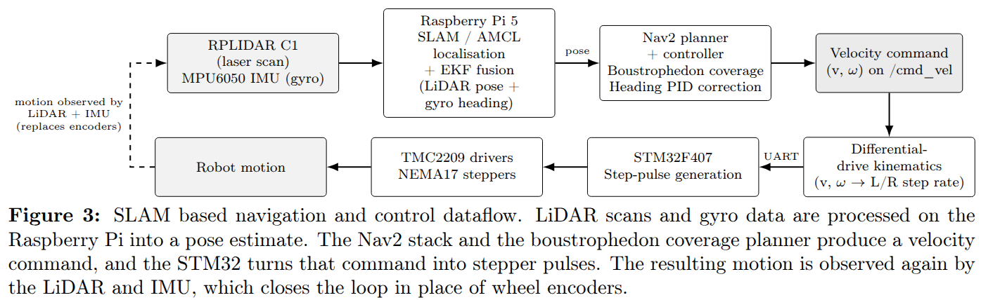
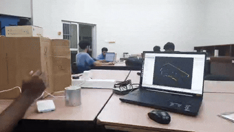
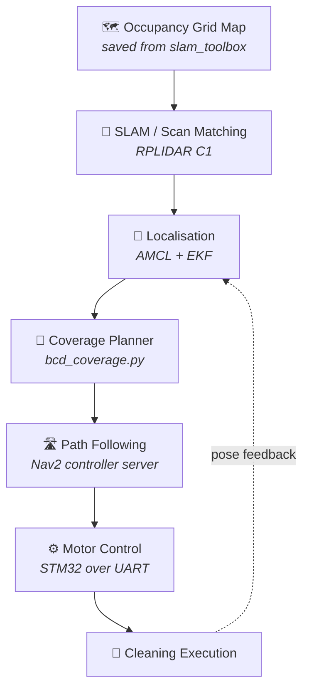
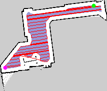
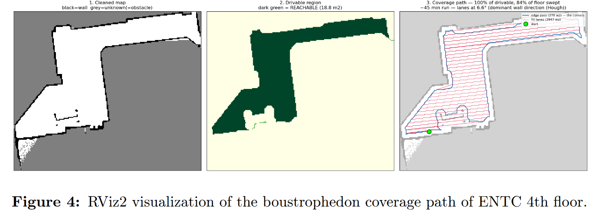
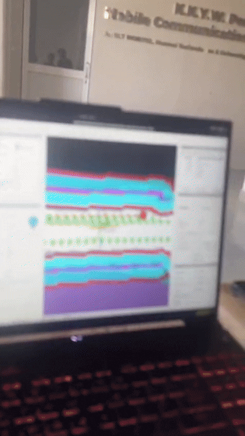
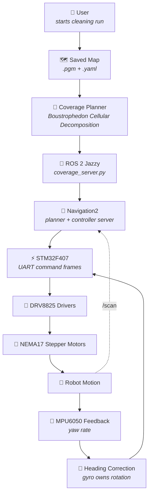

# 🧹 Smart Autonomous Floor Mopping Robot

### Autonomous coverage cleaning using ROS 2, LiDAR SLAM and Boustrophedon Cellular Decomposition

 

<!-- 📸 Replace with the robot / system overview image -->

---

## 📌 Overview

**The problem**

- 🔁 Consumer cleaning robots often rely on random-bounce motion, so floor area is covered unevenly and repeatedly.
- ⏱️ Random motion needs several times longer to approach full coverage of the same room.
- 🚫 Without a global map, the robot cannot report what it actually cleaned.

**Why coverage path planning matters**

- ✅ Guarantees every reachable cell of the floor is visited **at least once**.
- ✅ Minimises overlap, which directly reduces runtime and battery use.
- ✅ Produces a deterministic, repeatable and auditable cleaning route.

**What makes this project different**

| | |
|---|---|
| 🧭 | Full **Boustrophedon Cellular Decomposition (BCD)** planner written from scratch, not an off-the-shelf coverage plugin |
| ⚙️ | **Encoderless closed-loop motion control** using STM32 step verification plus MPU6050 yaw integration |
| 🗺️ | Lanes are aligned to the **dominant wall direction** via Hough transform, not to the image axes |
| 🧱 | Complete split-brain architecture: Raspberry Pi for planning, STM32 for real-time actuation |

---

## 🔧 Hardware Architecture

| Component | Model | Role |
|---|---|---|
| 🧠 High-level controller | **Raspberry Pi 5** (Ubuntu Server 24.04) | ROS 2 Jazzy, Nav2, SLAM, coverage planning |
| ⚡ Low-level controller | **STM32F407** | Real-time step generation and motion sequencing |
| 📡 LiDAR | **RPLIDAR C1** | 2D scanning for SLAM, localisation and obstacle sensing |
| 🧭 IMU | **MPU6050** | Yaw rate for rotation correction |
| 🔩 Actuators | **2 × NEMA17 stepper motors** | Differential drive, **no wheel encoders** |
| 🔌 Drivers | **DRV8825** | Microstepping current control |
| 🔋 Power | Isolated motor and logic rails | Motor supply kept off the Pi rail |

**Division of responsibility**

- ✔️ **Raspberry Pi** performs high-level navigation and all ROS 2 computation.
- ✔️ **STM32** performs real-time motor control over a UART link (`/dev/ttyAMA0`).
- ✔️ **RPLIDAR C1** performs SLAM and localisation.
- ✔️ **MPU6050** provides yaw rate for heading feedback.
- ✔️ **NEMA17 motors are encoderless**, so closed-loop behaviour is recovered in firmware.

<!-- 📸 Replace with the SLAM / system architecture image -->

<!-- 🎞️ Robot following the coverage path -->

Visualization of boundaries and obstacles with RPLidar C1

---

## 💻 Software Stack

| Layer | Technology | Purpose |
|---|---|---|
| 🤖 Middleware | **ROS 2 Jazzy** | Node graph, TF tree, message transport |
| 🧭 Navigation | **Navigation2** | Global and local planning, controller server, behaviour trees |
| 🗺️ SLAM | **slam_toolbox** | Online async mapping and pose graph optimisation |
| 📍 Localisation | **AMCL** | Particle filter localisation against the saved map |
| 🔗 Fusion | **robot_localization (EKF)** | Fuses wheel translation with MPU6050 yaw |
| ⚙️ Hardware interface | **ros2_control** (C++) | `StepperDiffDrive` plugin, UART protocol to STM32 |
| 🧮 Coverage planner | **Python + OpenCV + NumPy + SciPy** | BCD decomposition, Hough wall alignment, path export |
| 👁️ Visualisation | **RViz2** | Map, costmaps, TF, live coverage waypoint markers |
| 🔬 Firmware | **STM32 HAL / C** | Timer-driven step pulses, protocol parser, motion queue |

---

## 🧭 Boustrophedon Cellular Decomposition

> *Boustrophedon* is Greek for "as the ox turns while ploughing", which is exactly the back-and-forth motion the planner produces.

**What BCD is**

- A coverage algorithm that divides free space into obstacle-free **cells**, then sweeps each cell with parallel lanes.
- Classic formulation by Choset, widely used for cleaning, agricultural and inspection robots.

**Why decompose at all**

- 🧩 A room with obstacles is **not** a simple rectangle, so a single sweep pattern would either clip obstacles or leave gaps.
- 🧩 Each cell **is** obstacle free by construction, so inside a cell coverage becomes trivial.

**Why obstacles split the environment**

- A vertical sweep line is passed across the map one pixel column at a time.
- The number of connected free **slices** in that column is counted.
- When that count changes, an obstacle has started or ended. That column is a **critical point**.
- 🔻 Slice count increases → **IN event** → the current cell splits into new cells.
- 🔺 Slice count decreases → **OUT event** → cells merge and are closed.

**How cells are covered**

1. Lanes are spaced by the mop width minus a small overlap.
2. Within a cell the robot drives to one end of a lane, then the other.
3. The next lane is entered from the side it finished on, giving the zig-zag.
4. Cells are visited in sweep order so the transition between cells is short.

**Why zig-zag**

- ➡️ Removes the need to return to a start point after each lane, which would nearly double travel distance.
- ➡️ Turns occur only at lane ends, so the number of rotations is minimal.
- ➡️ Repeated cleaning is bounded to the deliberate lane overlap only.

**Advantages over random coverage**

| Criterion | Random bounce | BCD |
|---|---|---|
| Coverage guarantee | ❌ Probabilistic | ✅ Complete over reachable space |
| Overlap | ❌ Uncontrolled | ✅ Fixed by lane spacing |
| Runtime | ❌ Long and variable | ✅ Predictable, estimated before running |
| Repeatability | ❌ Different every run | ✅ Deterministic |
| Reporting | ❌ Not possible | ✅ Waypoint level progress |

**Implementation notes**

- Free space is eroded by robot radius plus safety margin so the planned path is a valid **centre** trajectory.
- Unknown map cells are treated as blocked, so the planner never drives into unmapped space.
- Only the connected component reachable from the start pose is planned.
- Hairline gaps in walls are sealed morphologically so lanes cannot leak into another room.
- A Hough transform finds the dominant wall angle and the map is rotated so lanes run **parallel to the walls**.

---

## 🚦 Robot Navigation Pipeline

---

## ⭐ Unique Closed-Loop Encoderless Control

> [!IMPORTANT]
> **The robot has no wheel encoders by design.** Closed-loop motion is recovered from two independent sources: verified step counts on the STM32, and integrated yaw rate from the MPU6050. This is one of the core engineering contributions of the project.

**Why no encoders**

- 💰 Removes two encoders, their wiring and their interrupt load.
- 🧪 Stepper motors already move in discrete, known increments, so position is commanded rather than measured.

**During straight motion**

- The STM32 is commanded an **exact pulse count** rather than a continuous velocity.
- The firmware counts every pulse it generates on the step timer.
- The next command is not accepted until the commanded step count has been **fully completed**.
- 📏 Distance therefore closes on the commanded value instead of on elapsed time.

**During turning**

- ❌ Wheel-derived heading is **not trusted**. A single lost step on an encoderless drivetrain corrupts the yaw estimate permanently.
- ✅ The MPU6050 gyroscope **z-axis rate is integrated** to obtain the angle actually turned.
- ✅ The measured angle is prioritised over the theoretical value predicted by wheel odometry.
- ✅ In the EKF, wheel odometry contributes translation only, and the gyro owns rotation entirely.

**Result**

| Behaviour | Before | After |
|---|---|---|
| Heading drift over repeated rotations | Accumulating | Substantially reduced |
| SLAM map doubling on turns | Present | Eliminated |
| Straight-line distance error | Time dependent | Step-count bounded |

---

## 🗺️ Mapping

**Pipeline**

- 📡 **RPLIDAR C1** publishes `/scan` at the robot base frame, orientation corrected in the URDF.
- 🧠 **slam_toolbox** runs in online asynchronous mode, building and optimising the pose graph.
- 🧱 The result is an **occupancy grid**: free, occupied and unknown cells at 5 cm resolution.
- 💾 The map is saved with `map_saver_cli` into a `.pgm` image plus a `.yaml` descriptor.
- 🧭 The saved map is then served to **AMCL** and to the coverage planner.

<!-- 📸 Generated occupancy grid map -->

 Occupancy grid produced by slam_toolbox

  

<!-- 📸 Coverage path preview -->

 BCD coverage path generated over the saved map

  

<!-- 📸 Coverage path preview -->

 BCD coverage path generated over the saved map

  

<!-- 📸 RViz2 visualisation -->

 RViz2: map, costmaps, TF tree and colour-coded coverage waypoints

---

## 🎥 Navigation Demonstration

<!-- 🎞️ Robot following the coverage path -->

Real robot navigation 

  

Robot following the boustrophedon cellular decomposition coverage algorithm

---

## 📂 Repository Structure

<b>🧭 Coverage planning</b>

| File | Purpose | Importance | Stage |
|---|---|---|---|
| `bcd_coverage.py` | Standalone BCD planner. Sweep-line decomposition, Hough wall alignment, serpentine generation, YAML and preview export | 🔴 Core | Offline planning |
| `ros2_ws/src/minibot_coverage/minibot_coverage/prepare_map.py` | In-package map preparation and lane generation | 🔴 Core | Offline planning |
| `ros2_ws/src/minibot_coverage/minibot_coverage/coverage_server.py` | Replays the waypoint YAML through Nav2, tracks per-waypoint status, publishes `/coverage_waypoints` markers | 🔴 Core | Runtime |
| `ros2_ws/src/minibot_coverage/config/coverage_params.yaml` | Lane spacing, robot radius, tolerances | 🟠 High | Configuration |
| `ros2_ws/src/minibot_coverage/launch/coverage.launch.py` | Brings up the coverage server | 🟠 High | Launch |

<b>🗺️ Navigation and SLAM</b>

| File | Purpose | Importance | Stage |
|---|---|---|---|
| `ros2_ws/src/minibot_navigation/config/nav2_params.yaml` | Full Nav2 configuration: AMCL, planner, controller, costmaps, recoveries | 🔴 Core | Runtime |
| `ros2_ws/src/minibot_navigation/config/slam_mapping.yaml` | slam_toolbox online async parameters | 🔴 Core | Mapping |
| `ros2_ws/src/minibot_navigation/config/keepout_params.yaml` | Keep-out filter mask parameters | 🟡 Medium | Runtime |
| `ros2_ws/src/minibot_navigation/behavior_trees/navigate_through_poses_coverage.xml` | Behaviour tree tuned for long waypoint sequences | 🟠 High | Runtime |
| `ros2_ws/src/minibot_navigation/behavior_trees/navigate_to_pose_dock.xml` | Single-goal docking behaviour tree | 🟡 Medium | Runtime |
| `robot_files/slam_params.yaml` | Standalone SLAM parameter set used during bring-up | 🟡 Medium | Mapping |
| `robot_files/nav2_params.yaml` | Standalone Nav2 parameter set used during bring-up | 🟡 Medium | Runtime |

<b>🤖 Robot description and visualisation</b>

| File | Purpose | Importance | Stage |
|---|---|---|---|
| `ros2_ws/src/minibot_description/urdf/robot.urdf.xacro` | Top-level robot model | 🔴 Core | Bring-up |
| `ros2_ws/src/minibot_description/urdf/base.xacro` | Chassis, wheels, differential drive geometry | 🟠 High | Bring-up |
| `ros2_ws/src/minibot_description/urdf/lidar.xacro` | RPLIDAR C1 mount and frame, includes the 180° orientation fix | 🟠 High | Bring-up |
| `ros2_ws/src/minibot_description/urdf/imu.xacro` | MPU6050 frame definition | 🟠 High | Bring-up |
| `ros2_ws/src/minibot_description/urdf/ros2_control.xacro` | ros2_control hardware interface declaration | 🔴 Core | Bring-up |
| `ros2_ws/src/minibot_description/urdf/inertial_macros.xacro` | Reusable inertia macros | 🟡 Medium | Bring-up |
| `ros2_ws/src/minibot_description/rviz/navigation.rviz` | RViz2 layout for navigation and coverage | 🟠 High | Visualisation |
| `ros2_ws/src/minibot_description/rviz/view_robot.rviz` | RViz2 layout for model inspection | 🟡 Medium | Visualisation |
| `robot_files/robot.urdf` | Flattened URDF used during early bring-up | 🟡 Medium | Bring-up |

<b>⚙️ Hardware interface and STM32 link</b>

| File | Purpose | Importance | Stage |
|---|---|---|---|
| `ros2_ws/src/minibot_hardware/src/stepper_diffdrive.cpp` | `StepperDiffDrive` ros2_control system plugin, converts wheel commands to STM32 frames | 🔴 Core | Runtime |
| `ros2_ws/src/minibot_hardware/include/minibot_hardware/stepper_diffdrive.hpp` | Plugin interface declaration | 🟠 High | Runtime |
| `ros2_ws/src/minibot_hardware/include/minibot_hardware/serial_link.hpp` | UART transport, framing and timeout handling | 🔴 Core | Runtime |
| `ros2_ws/src/minibot_hardware/minibot_hardware.xml` | pluginlib export descriptor | 🟠 High | Build |
| `ros2_ws/src/minibot_hardware/test/test_protocol.cpp` | Unit tests for the serial protocol | 🟡 Medium | Verification |
| `robot_files/real_serial_bridge.py` | Lightweight Twist to UART bridge used before the ros2_control plugin | 🟡 Medium | Bring-up |

<b>🔬 STM32 firmware</b>

| File | Purpose | Importance | Stage |
|---|---|---|---|
| `stm32/Core/Src/minibot_motion.c` | Step generation, pulse counting and **step completion verification** | 🔴 Core | Real time |
| `stm32/Core/Inc/minibot_motion.h` | Motion module interface | 🟠 High | Real time |
| `stm32/Core/Src/minibot_protocol.c` | UART command parser and acknowledgement handling | 🔴 Core | Real time |
| `stm32/Core/Inc/minibot_protocol.h` | Protocol definitions shared with the Pi side | 🟠 High | Real time |
| `stm32/Core/Inc/minibot_config.h` | Steps per metre, wheelbase, microstepping, pin mapping | 🔴 Core | Configuration |
| `stm32/Core/Src/main.c` | Peripheral init and main control loop | 🟠 High | Real time |
| `stm32/Core/Src/tim.c` | Timer configuration driving the step pulses | 🟠 High | Real time |
| `stm32/Core/Src/usart.c` | UART peripheral configuration | 🟡 Medium | Real time |

<b>🧭 IMU and sensor fusion</b>

| File | Purpose | Importance | Stage |
|---|---|---|---|
| `ros2_ws/src/minibot_imu/minibot_imu/mpu6050_node.py` | Reads the MPU6050 over I2C, applies axis mapping, publishes `/imu/data` | 🔴 Core | Runtime |
| `ros2_ws/src/minibot_imu/minibot_imu/imu_calibrate.py` | Gyro bias calibration exposed as `/imu/recalibrate` | 🟠 High | Calibration |
| `ros2_ws/src/minibot_imu/config/imu_params.yaml` | Axis map, bias, covariance settings | 🟠 High | Configuration |
| `ros2_ws/src/minibot_imu/config/ekf.yaml` | robot_localization fusion matrix, wheel yaw deliberately disabled | 🔴 Core | Configuration |
| `ros2_ws/src/minibot_imu/launch/imu.launch.py` | IMU and EKF bring-up | 🟠 High | Launch |
| `robot_files/odometry_node.py` | Gyro-integrated odometry node with TF broadcast, used during bring-up | 🟠 High | Bring-up |
| `robot_files/imu_verify.py` | I2C level IMU verification utility | 🟡 Medium | Diagnostics |

<b>🚀 Bring-up, launch and system integration</b>

| File | Purpose | Importance | Stage |
|---|---|---|---|
| `ros2_ws/src/minibot_bringup/launch/robot.launch.py` | Full robot bring-up: description, controllers, LiDAR, IMU, EKF | 🔴 Core | Launch |
| `ros2_ws/src/minibot_bringup/launch/map.launch.py` | SLAM mapping session | 🔴 Core | Launch |
| `ros2_ws/src/minibot_bringup/launch/clean.launch.py` | Localisation, Nav2 and coverage in one cleaning run | 🔴 Core | Launch |
| `ros2_ws/src/minibot_bringup/launch/rviz.launch.py` | RViz2 with the navigation layout | 🟡 Medium | Launch |
| `ros2_ws/src/minibot_bringup/config/controllers.yaml` | `diff_drive_controller` and joint state broadcaster | 🔴 Core | Configuration |
| `ros2_ws/src/minibot_bringup/config/twist_mux.yaml` | Priority arbitration between teleop and Nav2 velocity commands | 🟠 High | Configuration |
| `ros2_ws/src/minibot_bringup/config/derived_params.yaml` | Steps per metre and geometry derived from `robot.yaml` | 🟠 High | Configuration |
| `ros2_ws/src/minibot_bringup/config/diagnostics.yaml` | Runtime diagnostics aggregation | 🟡 Medium | Configuration |
| `ros2_ws/src/minibot_bringup/scripts/calibrate_odom.py` | Empirical calibration of steps per metre and wheelbase | 🟠 High | Calibration |
| `ros2_ws/src/minibot_bringup/scripts/stm32_bench.py` | UART link latency and throughput benchmark | 🟡 Medium | Verification |
| `ros2_ws/src/minibot_bringup/udev/99-minibot.rules` | Stable device names for LiDAR and STM32 | 🟠 High | Deployment |
| `ros2_ws/src/minibot_bringup/systemd/minibot-robot.service` | Auto-start of the robot stack on boot | 🟡 Medium | Deployment |
| `ros2_ws/src/minibot_bringup/systemd/minibot-clean.service` | Auto-start of the cleaning run | 🟡 Medium | Deployment |
| `robot.yaml` | Single source of truth for all physical robot parameters | 🔴 Core | Configuration |

<b>📖 Documentation</b>

| File | Purpose |
|---|---|
| `docs/ARCHITECTURE.md` | System and node architecture |
| `docs/HARDWARE.md` | Wiring, power and component detail |
| `docs/INTERFACES.md` | UART protocol and ROS interface contracts |
| `docs/DERIVED_NUMBERS.md` | Derivation of steps per metre, wheelbase and limits |
| `docs/TESTING.md` | Test and verification procedure |
| `docs/FILE_MANIFEST.md` | Complete file inventory |

---

## 🔄 Complete System Workflow

---

## ✨ Features

- ✅ Autonomous coverage path planning
- ✅ Boustrophedon Cellular Decomposition planner implemented from first principles
- ✅ Wall-aligned lane generation using Hough transform
- ✅ ROS 2 Jazzy and Navigation2 integration
- ✅ SLAM mapping with `slam_toolbox`
- ✅ AMCL localisation on the saved map
- ✅ RViz2 visualisation with live colour-coded coverage progress
- ✅ Closed-loop encoderless motion control
- ✅ MPU6050 yaw integration for rotation correction
- ✅ EKF sensor fusion with wheel yaw deliberately excluded
- ✅ Raspberry Pi 5 high-level planning
- ✅ STM32F407 real-time low-level control
- ✅ RPLIDAR C1 scanning and localisation
- ✅ Custom UART protocol with unit tests
- ✅ Systemd and udev deployment for headless operation

---

## 🚧 Future Improvements

| Area | Planned work |
|---|---|
| 🚧 Obstacle handling | Adaptive avoidance of dynamic obstacles during a sweep |
| 🔁 Replanning | Online re-decomposition when the map changes mid-run |
| 🏠 Multi-room | Room segmentation and inter-room sequencing |
| 🔋 Energy | Battery-aware planning with resume from the last waypoint |
| 📷 Vision | Camera integration for dirt and surface detection |
| 🧠 AI | Object detection to classify and avoid hazards |
| ☁️ Telemetry | Cloud monitoring of coverage reports |

---

**Branch:** `Self_Navigation` &nbsp;•&nbsp; **Platform:** ROS 2 Jazzy on Raspberry Pi 5 &nbsp;•&nbsp; **Firmware:** STM32F407

